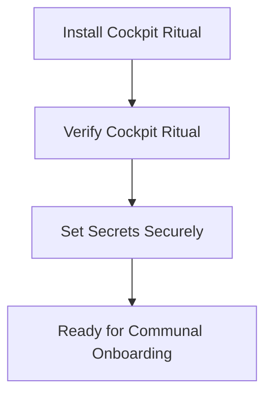

## Cockpit Ritual Tasks (VS Code)

This repository includes VS Code tasks to automate cockpit rituals:

### Available Tasks
- **Install Cockpit Ritual**  
  Runs `scripts/install_powershell_profile.ps1`.  
  - Backs up your PowerShell profile.  
  - Appends the cockpit ritual block if missing.  
  - Creates and registers the commit template.  
  - Runs verification automatically.

- **Verify Cockpit Ritual**  
  Runs `scripts/verify_cockpit.ps1`.  
  - Checks if the `cc` alias is callable.  
  - Confirms Git commit template registration.  
  - Prints clear ✅/❌ feedback.

### How to Run
From VS Code:
1. Open the Command Palette (`Ctrl+Shift+P`).
2. Choose **Tasks: Run Task**.
3. Select either:
   - *Install Cockpit Ritual* to wire your profile and commit template.
   - *Verify Cockpit Ritual* to check cockpit health.

Or run manually in PowerShell:
```powershell
pwsh -File scripts/install_powershell_profile.ps1
pwsh -File scripts/verify_cockpit.ps1
```

Notes:
- Running the installer will back up your existing profile to a `*.backup` file in your PowerShell profile directory.
- The installer also creates `.claude/commit-template.txt` and registers it with `git config --global commit.template`.
- If you want me to commit this doc and push the change, tell me to `commit & push` and I'll do it for you.

---

**Pro++: Verification Status (Badges)**

Unified + OS-specific badges to show health at a glance:

```


```

**Bridges**

- Local → CI Bridge: local scripts mirror CI steps so what passes locally passes in PR checks.
- Editor → CI Bridge: VS Code tasks run rituals; CI runs the same verification on PRs.
- Secrets Bridge: retrieve secrets locally from Credential Manager or environment; mirror as GitHub Actions secrets in CI.
- OS Bridge: workflow runs on Windows and Ubuntu so wiring is cross‑platform.

**Quick‑Start (3 steps)**

```powershell
pwsh -File scripts/install_powershell_profile.ps1
pwsh -File scripts/verify_cockpit.ps1
# Set secrets per OS as described below
```

**Secrets (local & CI)**

Windows (PowerShell):
```powershell
[System.Environment]::SetEnvironmentVariable("ANTHROPIC_API_KEY","<your_api_key>","User")
[System.Environment]::SetEnvironmentVariable("GITHUB_TOKEN","<your_pat>","User")
[System.Environment]::SetEnvironmentVariable("GITLAB_TOKEN","<your_pat>","User")
```

Linux (bash):
```bash
export ANTHROPIC_API_KEY="<your_api_key>"
export GITHUB_TOKEN="<your_pat>"
export GITLAB_TOKEN="<your_pat>"
source ~/.bashrc
```

GitHub Actions (Repository Settings → Secrets):
- `ANTHROPIC_API_KEY`
- `GITHUB_TOKEN`
- `GITLAB_TOKEN`

The workflow exports them into `$GITHUB_ENV` so `pwsh` steps can access them as environment variables.

**Onboarding Flow (Mermaid)**



<details> <summary>ASCII Fallback</summary>

```
+-------------------------+
| Install Cockpit Ritual  |
+-----------+-------------+
      |
      v
+-------------------------+
| Verify Cockpit Ritual   |
+-----------+-------------+
      |
      v
+-------------------------+
| Set Secrets Securely    |
+-----------+-------------+
      |
      v
+-------------------------+
| Communal Onboarding     |
+-------------------------+
```

</details>

---

# 🛠️ Cockpit Rituals (Pro+++ Edition)

## 🔮 Verification Status (Badges)
Replace `<YOUR_ORG>`/`<YOUR_REPO>` with your org and repository (examples use this repo's owner/name):

```


```

---

## 🌉 Bridges

- **Local → CI Bridge**: Local scripts mirror CI workflow steps so what passes locally passes in PR checks.
- **Editor → CI Bridge**: VS Code tasks run rituals with a keystroke; CI runs them automatically on PRs.
- **Secrets Bridge**: Secrets wired via Credential Manager or env vars locally; mirror them as GitHub Actions secrets.
- **OS Bridge (Matrix)**: Workflow runs on Windows (`pwsh`) and Ubuntu (`pwsh Core`) for communal clarity.

---

## ⚡ Quick‑Start Chant (3 Steps)

1. **Install the Ritual**
```powershell
pwsh -File scripts/install_powershell_profile.ps1
```

2. **Verify the Ritual**
```powershell
pwsh -File scripts/verify_cockpit.ps1
```

3. **Set Secrets Securely**

Windows (PowerShell):
```powershell
[System.Environment]::SetEnvironmentVariable("ANTHROPIC_API_KEY","<your_api_key>","User")
[System.Environment]::SetEnvironmentVariable("GITHUB_TOKEN","<your_pat>","User")
[System.Environment]::SetEnvironmentVariable("GITLAB_TOKEN","<your_pat>","User")
```

Linux (bash):
```bash
export ANTHROPIC_API_KEY="<your_api_key>"
export GITHUB_TOKEN="<your_pat>"
export GITLAB_TOKEN="<your_pat>"
source ~/.bashrc
```

GitHub Actions (Repository Settings → Secrets and variables → Actions):
- `ANTHROPIC_API_KEY`
- `GITHUB_TOKEN` (or a PAT if you need repo-write ability)
- `GITLAB_TOKEN`

The matrix workflow exports these into `$GITHUB_ENV` so the `pwsh` steps can access them as environment variables.

---

## 🧩 CI Workflow (Matrix Build)

Use the existing `verify-cockpit.yml` matrix workflow — it runs the verification on both Windows and Ubuntu. If you want I can add venv caching to speed CI runs.

---

If you want these badges in your `README.md` instead of `docs`, tell me and I'll add them where you prefer.

---

## 🔮 Cockpit Verification Status (Matrix Workflow)

The cockpit is continuously verified across **Windows** and **Ubuntu** runners.  
Badges below reflect the current communal health of the ritual:

```


```

---

### 🧩 Matrix Workflow Summary
- **Windows**: Uses `actions/setup-powershell` to ensure latest `pwsh`.  
- **Ubuntu**: Installs PowerShell Core via apt, caches `.venv` for speed.  
- **Secrets**: Exported OS‑specific (`bash` → `$GITHUB_ENV`, `pwsh` → `$env:`).  
- **Cache**: `.venv` path hashed against `scripts/create_claude_venv.ps1` for reproducibility.  
- **Verification**: Runs `scripts/verify_cockpit.ps1` to confirm alias + commit template health.

---

### 🔑 Security Notes
- Add secrets in **Settings → Secrets and variables → Actions**:  
  - `ANTHROPIC_API_KEY`  
  - `GITHUB_TOKEN` (or PAT)  
  - `GITLAB_TOKEN`  
- Local mirrors: Credential Manager (Windows) or `~/.bashrc` (Linux/macOS).  
- Cache invalidation: update `create_claude_venv.ps1` to refresh communal lineage.

---

✨ With this section, `cockpit-ritual.md` now narrates **badges + matrix workflow health** directly, making onboarding and verification visible in one glance.

---

## 🛠️ Troubleshooting Rituals

When a badge goes red, follow the ritual below:

| Badge | Meaning | Ritual Fix |
|-------|---------|------------|
| Connectivity | Runner cannot reach GitHub (DNS/HTTP) or token invalid | Run `make connectivity-check` locally. If it fails, fix DNS/proxy. Verify `REPO_WRITE_TOKEN` secret in GitHub. |
| Validator | Manifest schema or unit tests failed | Run `make validate` locally. Fix YAML errors or failing pytest cases before pushing. |
| Risk Merge PR | Auto-merge into `risk.yml` or PR creation failed | Check validator and connectivity logs first. If both are green, verify `REPO_WRITE_TOKEN` has correct repo scope. |
| Ledger Rotation | Token/secret rotation workflow failed | Confirm rotation secrets are valid and not expired. Update GitHub secrets if needed. |
| Manifest Errors (Grafana) | Live Prometheus metric shows validation errors | Inspect dashboards. Run `make validate` locally to reproduce. Fix manifests until metric count drops. |

---

## ⚡ Quick Spells (One-liners)

| Action | Command |
|--------|---------|
| Run connectivity probe | `make connectivity-check` |
| Validate manifests + tests | `make validate` |
| Run risk merge locally | `make merge-risk` |


